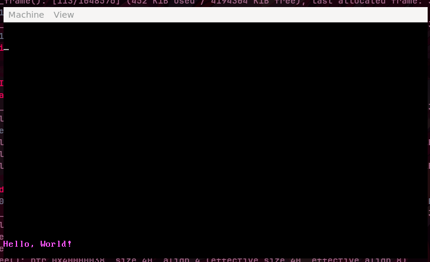
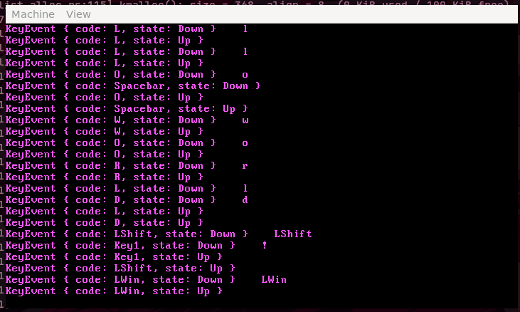
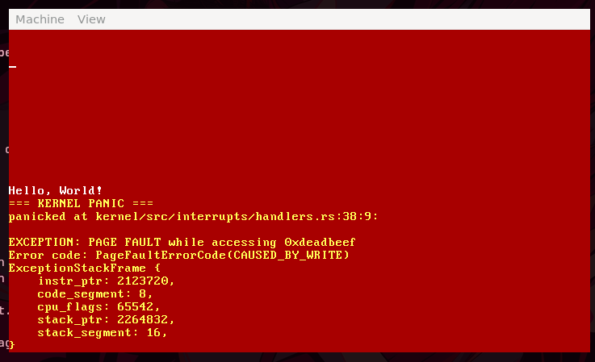

<div align="center">
  <h1>ThatMagicalOS</h1>
  <p>A simple, modern, 64-bit operating system kernel crafted in Rust.</p>
  
  
  
  
</div>

---

**ThatMagicalOS** is a from-scratch operating system kernel built in Rust (with a little bit of x86_64 assembly). It leverages Rust's safety and modern tooling to build foundational OS primitives. 

This project was built for the sake of learning how operating systems work under the hood and having fun bringing a machine to life!

## Screenshots

| Booting up | Keyboard | Kernel Panic Screen |
|:---:|:---:|:---:|
|  |  |  |

## Current Features

What makes ThatMagicalOS magical?
good question... even idk, but here's the progress so far xD

- **Multiboot2 Booting**: Compatible with multiboot2, booted via an ISO image.
- **Memory Management**: 
  - Physical memory tracking using a custom Bitmap Frame Allocator.
  - Global heap allocation (giving access to Rust's `alloc` crate, e.g. `Box`, `Arc`, `Vec`).
- **Hardware Integration**:
  - **APIC & IOAPIC**
- **Asynchronous Execution**: Includes a simple `async/await` task executor! The PS/2 keyboard driver utilizes `crossbeam-queue` to handle keypresses asynchronously.
- **Preemptive Multitasking**: OS Threads and a simple Robin Round SCheduler.
- **Display & Logging**:
  - ~Custom VGA text buffer interface with color support~
  - VESA graphics with a custom text renderer
  - qemu logging to easily see kernel traces in the host terminal.

## Getting Started

### Prerequisites

You need a Linux environment (or WSL2) with the following tools installed:

1. **Rust Nightly**: The kernel relies on unstable features (like `#![feature(allocator_api)]`) and custom target JSONs.
   ```bash
   rustup toolchain install nightly
   rustup default nightly
   rustup component add rust-src
   ```
2. **QEMU**: For emulating the x86_64 machine.
3. **GRUB & xorriso**: To generate the bootable `.iso` file.

### Building and Running

Running the OS is completely automated via Cargo thanks to `.cargo/config.toml` and our custom `run.sh` script!

Just clone the repository and run:

```bash
cargo run --release
```

This command will:
1. Compile the kernel for the custom `arch/x86_64.json` target.
2. Build a `magical.iso` using `grub-mkrescue`.
3. Launch QEMU with 2GB of RAM, attaching serial output directly to your current terminal.

## Roadmap (ToDos)

I'm constantly trying to add magic, here's the rough roadmap of features I want to implement:

- [x] **Phase 1: Hardware Interrupts** (VGA, APIC, IOAPIC, Keyboard async tasks, Timer)
- [ ] **Phase 2: Multitasking** (Context switching, Scheduler, Kernel threads)
    - [x] Implement an asynchronous task executor to run multiple tasks concurrently.
    - [x] Implement OS Threads and a simple executor.
    - [ ] Add support for user-space processes and context switching between them.
- [ ] **Phase 3: Storage** (PCI enumeration, Block devices, VFS, FAT32)
    - [ ] Implement PCI enumeration to detect storage devices.
    - [ ] Build a simple block device driver and a virtual file system (VFS)
    - [ ] Add support for a simple filesystem like FAT32 to read/write files from disk.
- [ ] **Phase 4: User Space** (Syscalls, Processes, ELF loader)

## Acknowledgements

- Learning from incredible resources and projects like the [OSDev Wiki](https://wiki.osdev.org/), [OSTEP](https://pages.cs.wisc.edu/~remzi/OSTEP/), [RedoxOS](https://gitlab.redox-os.org/redox-os/kernel), [AuroraOS](https://codeberg.org/aurora-org/AuroraOS), [Intel SDM](https://www.intel.com/content/www/us/en/developer/articles/technical/intel-sdm.html/) (probably not as incredible but this is all i have TT) and Philipp Oppermann's [Writing an OS in Rust](https://os.phil-opp.com/).
